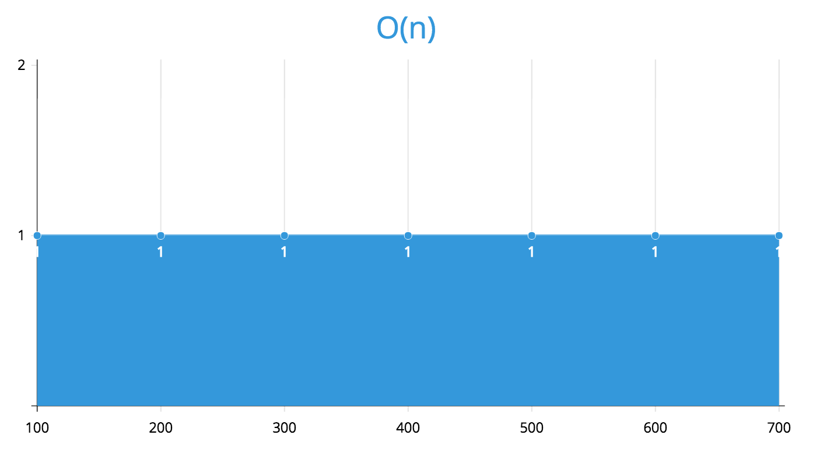

### O(1) - Constant Time

As the name implies (and as already discussed), `O(1)` or Constant Time remains constant regardless of the complexity.  Most times, complexity simply refers to the number of elements that the algorithm needs to iterate over.  So the algorithm will take the same amount of time to process 5 items as it will to process 500.

Here's a simple example of an algorithm that performs in constant time:

```
function getFirstItem(arr) {
  return arr[0];
}
```

Regardless of how many elements are passed in to the algorithm, it will take the same amount of time to perform the single operation of returning the first item in the array.  If it takes 1ms to return the first item in the array, it will take 1ms for 5 elements and also 1ms for 500 elements.  

Plotted on a chart, this would be a flat line.


