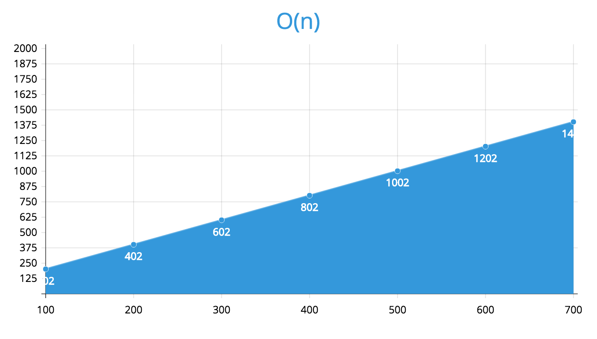

### O(n) - Linear Time

We already looked at a linear algorithm using the example from the course work.  But just because, let's take a look at a second example:

```
function search(arr, term) {
  for (var i = 0; i < arr.length; i++) {
    if (arr[i] === term) {
      return true;
    }
  }

  return false;
}
```

The `search` function is similar to the `sum` function from the course.  We're looping through an array, but instead of adding up all the values we're looking for a particular term inside the array.  This is actually a good example of why we use the worst case scenario when calculating complexity.  Say for example we have an array of `var animals = ['dog', 'cat', 'pig', 'cow']` and we run the search function `search(animals, 'dog')`.  The `dog` value is the first element in the array, so the best case scenario is that our `for` loop will execute once and `return`.  So our best case scenario is actually `O(1)`, but unfortunately this scenario doesn't happen 100% of the time.  So instead, we must look at the worst case scenario which would be `search(animals, 'cow')`.  With `cow` being the last value in the array, our `for` loop would have to iterate over each animal (4 times) before it found the match.  So for the 4 animals, the algorithm can be represented as `O(4)`, if we had 100 animals it would be `O(100)`.  Notice how the number in the brackets matches the number of elements in the array.  That's how we know that this is `O(n)`, where `n` is the number of elements in the array.

Plotted on a chart, we'd see a straight line increasing at a constant rate as more elements are processed.


