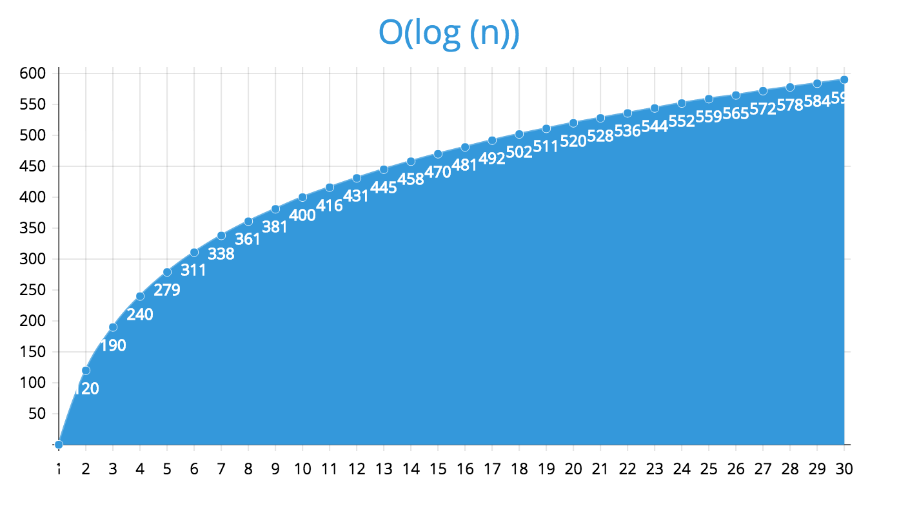

### O(log n) - Logarithmic Time

Now we start getting more complicated.  The perfect example of a Logarithmic algorithm is binary search.  So let's start with the hard part, the math:  In a perfect logarithmic algorithm, time will increase in a linear way and the `n` (number of elements) increases exponentially.  So for example:

```
n = 10 elements
s = 1 ms

n = n^2 = 10^2 = 100 elements
s = s + 1 = 1 + 1 = 2 ms

n = n^2 = 100^2 = 10,000 elements
s = s + 1 = 2 + 1 = 3 ms

n = n^2 = 1,000^2 = 1,000,000 elements
s = s + 1 = 3 + 1 = 4 ms
```

There's a whole lot of math going on that is going to be really boring to show, so I'll avoid that.  Basically, with a logarithmic algorithm the goal is to find out the maximum number of times we must execute a piece of code (like a search) before we get the desired result.  Really, the only way to fully describe this is using a search type function.

Let's take the hot or cold game we built early on in our coursework.  Say the computer picks a number between 1 and 100, so 100 numbers total.  We could ask the computer 1 at a time (1, 2, 3, ...) and we'd eventually find the answer.  The best case scenario would be getting it on the first try (`O(1)`) and the worst case scenario would be getting it on the last try (`O(100)`).  Doing it this way would be a linear algorithm and would work if the computer just told you right or wrong.  But say the computer told you hotter or colder depending on your answer.  The ideal algorithm in that case would be to split the numbers down the middle and guess 50 (Move 1), if the computer says higher than you know it's in the upper half and you don't have to guess 1 - 49.  Now repeat, guess half way between 50 and 100 so 75 (Move 2).  The computer says lower, you've just eliminated 75 - 100 and know the number lies within 51 - 74.  Again, split the difference which would be around 62 (Move 3).  The computer now says higher and you know that the number is between 63 and 74.  The next guess should be 67 (Move 4) to which the computer responds with lower and our scope narrows to 63 - 66.  One more guess of 64 (Move 5) and the computer responds with higher and we know that the answer is 65.  While this might not necessarily be the worst case scenario, it's pretty close to it.  If you were to follow the same pattern, but increase the numbers that the computer can use to 1 - 10000 (100^2 - Exponential), you'd most likely find that it would take ~10 moves (5 + 5 - Linear) to find the correct number.

Alright, with that out of the way, let's look at a binary search example that kind of mimics the hot/cold process above:

```
// This search assumes that the array being
// passed into it is sorted in alphanumeric order
function binarySearch(arr, value) {
  var lower = 0,
      upper = arr.length - 1;

  // While our lower limit is less than or equal
  // to our higher limit, continue on with the loop
  while (lower <= upper) {
    // Graph the middle number between our
    // upper and lower bounds.  On the first
    // iteration, the lower bounds will be 0
    // and the upper bounds will be the length
    // of the array minus one.
    var mid = parseInt((lower + upper) / 2);

    // Grab the value at the middle index
    var current = arr[mid];

    // Check if the current value is greater than
    // the value we are looking for.  If so, that means
    // that our value is in the lower half.
    if (current > value) {
      // Change our upper bounds to be one
      // less than the current middle index
      high = mid - 1;
    } else if (current < value) {
      // If the current value is less than the
      // value we are looking for, then the value is
      // in the upper half.  We need to change our
      // lower bounds to be one more than our current
      // middle index
      low = mid + 1;
    } else {
      // If we got here, then our current value matches
      // our value we are looking for and we can end
      // the execution of our function
      return mid;
    }
  }

  // If we go here, then something bad happened and
  // we didn't find the value we were searching for
  return -1;
}
```

Another common analogy for a binary search or logarithmic algorithm is manually searching through a phone book.  We know that the phone book is in alphabetical order, so it works out perfectly for an `O(log n)` function.  You're given a person's name, say John Doe.  You flip to the middle of the phone book which lands you around the `M`'s.  You know that `Doe` is going to be in the first half between `A` - `M` so you flip to about the half way point between the front and middle of the book (1/4 right?). and now you land around the `G`'s.  Again, you know that `D` comes before `G` so again you split the difference and flip to roughly the half way point between `A` and `G` which lands you around `D`.  Perfect, now we're getting close.  You look at the first and last names on the page and determine if `Doe` is before or after your current page.  You'd rinse and repeat this process until you landed on the page that contained John Doe's phone number.  Obviously as a human, you can do this much faster by flipping through the `D` section until you were close to the right page.  But, unfortunately, computers don't have inference or reasoning and therefore has to do things procedurally.

Anyways, here's what a logarithmic algorithm might look like if you charted out the results:



Note!  It took forever to calculate 400 log(n), so be sure to take it all in.

The basic idea here is that as more elements are added, it takes slightly longer but not in a linear fashion.  More of a slow, smooth curve upwards (See my fancy graph again).
